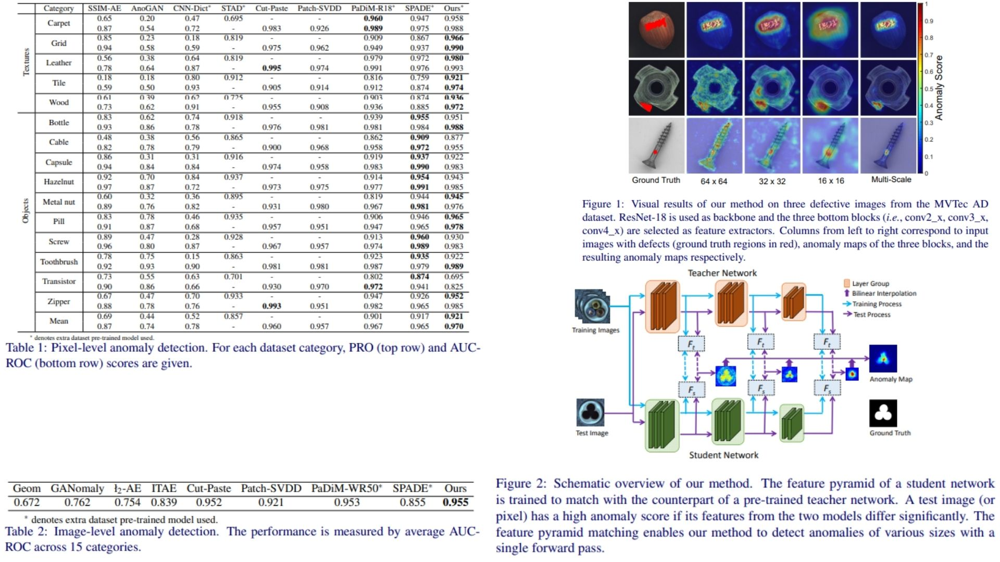

# 🧑‍🏫 STFPM-Replication — Student-Teacher Feature Pyramid Matching for Anomaly Detection

This repository provides a **faithful Python replication** of the **STFPM framework** for pixel-level anomaly detection.  
The goal is to **reproduce the model and pipeline from the paper** without full training or testing.

Highlights:

* **Pixel-wise anomaly detection** with teacher-student distillation 📚  
* Multi-scale **feature pyramid matching** 🏔️  
* Anomaly maps $$\Omega$$ and image-level scores $$\max(\Omega)$$ 📊  

Paper reference: *[Student-Teacher Feature Pyramid Matching for Anomaly Detection](https://arxiv.org/abs/2103.04257)*  

---

## Overview 🎨



> The pipeline trains a **student network** to mimic a **pretrained teacher network** on anomaly-free images.  
> Pixel-level anomalies are detected by measuring deviations between student and teacher feature pyramids across multiple scales.

Key points:

* **Teacher network**: powerful pretrained model (e.g., ResNet-18) ❄️  
* **Student network**: same architecture, trained to match teacher features ✨  
* **Feature pyramid matching**: bottom layers (conv2_x, conv3_x, conv4_x) provide multi-scale knowledge  
* **Anomaly map** $$\Omega$$: high values indicate pixel-level deviation from normal patterns  
* **Image-level score**: $$\max(\Omega)$$

---

## Core Math 📐

Pixel-wise feature loss at position $(i,j)$ for layer $l$:

$$
\ell^l(I_k)_{ij} = \frac{1}{2} \| \hat{F}_t^l(I_k)_{ij} - \hat{F}_s^l(I_k)_{ij} \|_2^2
$$

where $$\hat{F}$$ denotes **L2-normalized feature vectors**.  

Layer-level loss:

$$
\ell^l(I_k) = \frac{1}{w_l h_l} \sum_{i=1}^{w_l} \sum_{j=1}^{h_l} \ell^l(I_k)_{ij}
$$

Total pyramid loss:

$$
\mathcal{L}(I_k) = \sum_{l=1}^{L} \alpha_l \, \ell^l(I_k), \quad \alpha_l \ge 0
$$

Anomaly map (multi-scale fusion):

$$
\Omega(J) = \prod_{l=1}^{L} \text{Upsample}(\Omega^l(J))
$$

- $$\Omega^l(J)$$ = pixel-wise loss at layer $l$  
- Upsample = bilinear interpolation to original image size  

---

## Why STFPM Matters 🌿

* Learns **pixel-level anomaly maps** without anomalous training data 🔮  
* Multi-scale matching enables detection of **various anomaly sizes** 🏔️  
* Fast and modular: backbone and layers can be replaced or extended 🛠️  

---

## Repository Structure 🏗️

```bash
STFPM-Replication/
├── src/
│   ├── backbone/
│   │   ├── teacher.py              # frozen pretrained ResNet
│   │   ├── student.py              # trainable, same architecture
│   │   └── feature_extractor.py    # outputs conv2_x, conv3_x, conv4_x
│   │
│   ├── layers/
│   │   └── feature_normalization.py   # L2 normalization
│   │
│   ├── modules/
│   │   ├── loss.py                 # Eq(1)(2)(3) implementation
│   │   └── anomaly_map.py          # Eq(4) + upsample + product
│   │
│   ├── model/
│   │   └── stfpm.py                # full pipeline: teacher + student
│   │
│   └── config.py                   # α weights, upsample mode, hyperparams
│
├── images/
│   └── figmix.jpg                   # overview figure from paper
│
├── requirements.txt
└── README.md
```

---

## 🔗 Feedback

For questions or feedback, contact:  
[barkin.adiguzel@gmail.com](mailto:barkin.adiguzel@gmail.com)
